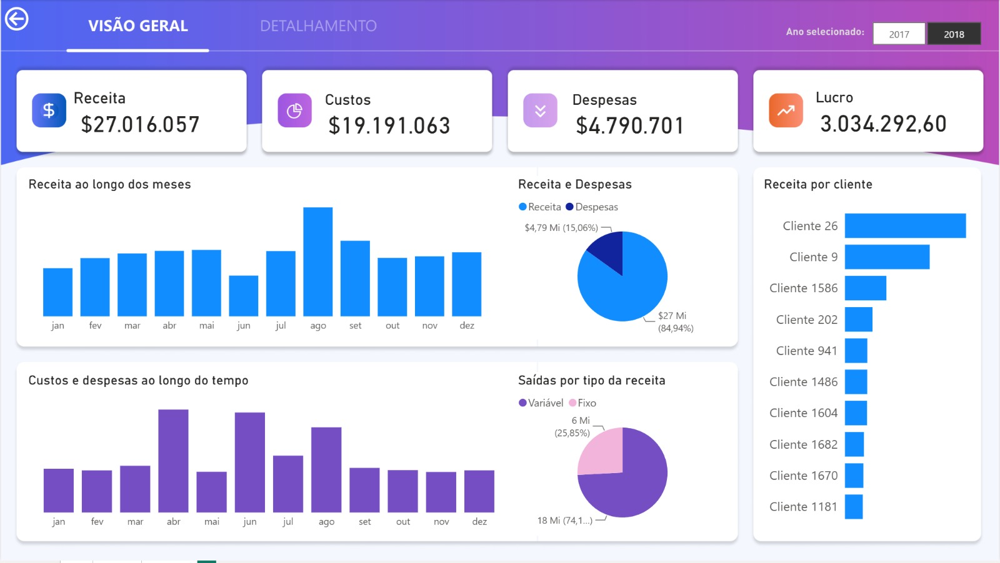
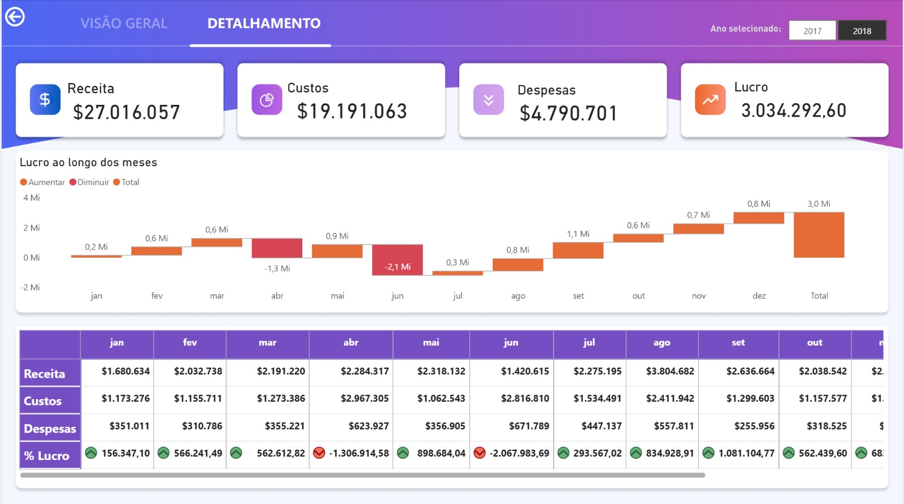

# 📊 Dashboard Financeiro - Vendas | Power BI


Projeto de **Business Intelligence** desenvolvido em **Power BI** para análise e acompanhamento do desempenho financeiro, com foco em **receitas, custos, despesas e lucro**.

O dashboard organiza os principais indicadores financeiros em uma experiência visual e interativa, permitindo acompanhar resultados, identificar variações ao longo do tempo e analisar informações de forma mais detalhada.

---

## 🖥️ Visualização do Dashboard

### 🏠 Capa

Página inicial do projeto, com navegação para as áreas de **Visão Geral** e **Detalhamento**.


### 📈 Visão Geral

A página **Visão Geral** apresenta os principais indicadores financeiros e permite acompanhar o desempenho do negócio de forma consolidada.

Entre as análises disponíveis estão:

- receita total;
- custos;
- despesas;
- lucro;
- evolução mensal da receita;
- comparação entre receita e despesas;
- custos e despesas ao longo do tempo;
- distribuição das saídas;
- receita por cliente;
- filtro por ano.



### 🔎 Detalhamento

A página **Detalhamento** permite analisar o resultado financeiro com maior profundidade, destacando a evolução do lucro ao longo dos meses e os valores mensais de receita, custos e despesas.



---

## 🎯 Objetivo do projeto

O objetivo deste projeto é centralizar informações financeiras em um único painel e transformar dados em indicadores de fácil interpretação.

Com o dashboard, é possível:

- acompanhar receitas, custos, despesas e lucro;
- analisar a evolução dos resultados ao longo dos meses;
- identificar períodos de maior ou menor desempenho;
- comparar entradas e saídas financeiras;
- analisar a participação dos clientes na receita;
- apoiar análises e tomadas de decisão com informações visuais.

---

## 📌 Principais indicadores

O dashboard acompanha os seguintes KPIs:

- **Receita**
- **Custos**
- **Despesas**
- **Lucro**

---

## 🧠 Modelagem de dados

O modelo semântico foi estruturado com tabelas de movimentações financeiras, plano de contas, calendário e medidas.

| Tabela | Finalidade |
|---|---|
| `Recebimentos1` | Informações relacionadas aos recebimentos |
| `Saidas` | Movimentações financeiras de saída |
| `Contas` | Plano de contas e classificação das movimentações |
| `Data` | Tabela calendário utilizada nas análises temporais |
| `Medidas` | Centralização dos indicadores utilizados no dashboard |

A tabela de datas permite relacionar as movimentações financeiras aos diferentes períodos analisados no relatório.

---

## 🛠️ Tecnologias e recursos utilizados

- **Power BI Desktop**
- **Power Query**
- **DAX**
- **Modelagem de dados**
- **Power BI Project (`.pbip`)**
- **TMDL**
- **Git**
- **GitHub**

---

## 📂 Estrutura do repositório

```text
.
├── Dash Financeiro - Vendas.pbip
├── Dash Financeiro - Vendas.Report/
├── Dash Financeiro - Vendas.SemanticModel/
├── images/
│   ├── capa.jpeg
│   ├── visao-geral.jpeg
│   └── detalhamento.jpeg
├── .gitignore
└── README.md
```

O projeto está armazenado no formato **PBIP**, permitindo que as definições do relatório e do modelo semântico sejam versionadas com Git.

---

## 📊 Fontes de dados

O projeto utiliza arquivos Excel como fontes de dados, incluindo:

- `Recebimentos.xlsx`
- `Pagamentos.xlsx`
- `CadastroPlanoContas.xlsx`

> **Observação:** os arquivos de dados de origem não estão incluídos neste repositório.

Para atualizar os dados em outro computador, será necessário configurar novamente as fontes no **Power Query**.

---

## ▶️ Como abrir o projeto

1. Faça o clone ou download deste repositório.
2. Abra o arquivo `Dash Financeiro - Vendas.pbip`.
3. Utilize o **Power BI Desktop** para visualizar e editar o projeto.
4. Caso queira atualizar os dados, configure os caminhos das fontes no **Power Query**.
5. Atualize o modelo.

---

## 🔄 Controle de versão

O projeto utiliza **Git e GitHub** para versionamento dos arquivos do Power BI.

Arquivos locais e de cache do Power BI são ignorados por meio do `.gitignore`, mantendo no repositório apenas os arquivos necessários ao desenvolvimento e ao controle de versão.

---

## 💡 Competências demonstradas

Este projeto demonstra conhecimentos em:

- desenvolvimento de dashboards em Power BI;
- tratamento e transformação de dados com Power Query;
- criação de indicadores com DAX;
- modelagem e relacionamento de dados;
- criação e utilização de tabela calendário;
- análise de indicadores financeiros;
- construção de análises temporais;
- organização de projetos Power BI no formato PBIP;
- versionamento com Git e GitHub;
- apresentação visual de informações para apoio à tomada de decisão.

---

## 👩‍💻 Autora

**Tabata Frade**

Projeto desenvolvido para fins de **estudo, portfólio e demonstração de habilidades em Business Intelligence e análise de dados**.
